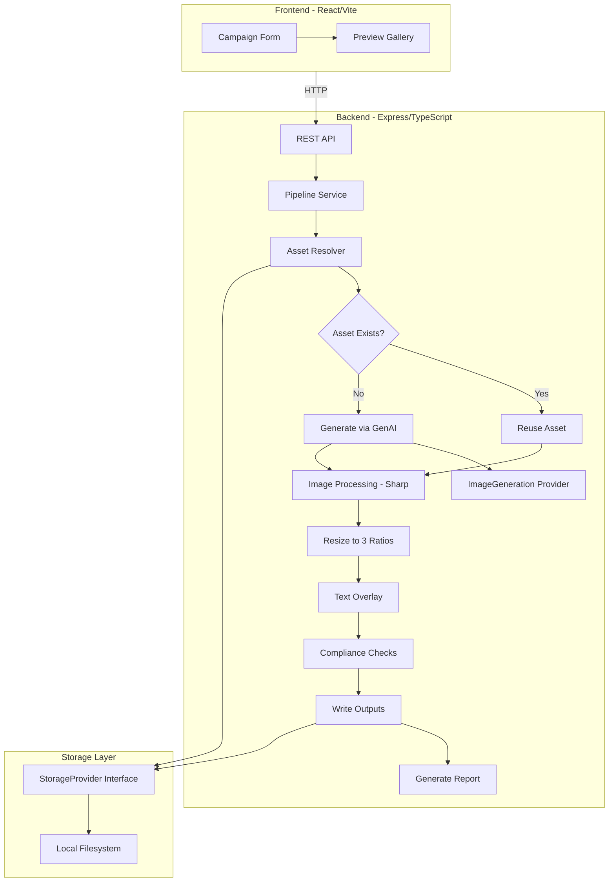

# Creative Automation for Scalable Social Ad Campaigns

A proof-of-concept creative automation pipeline that generates localized social media ad creatives from campaign briefs. Built for Adobe's FDE take-home exercise.

## Project Overview

This system automates the creation of social ad campaign assets by:

1. Accepting campaign briefs (JSON) and optional product assets
2. Reusing existing assets when available
3. Generating missing hero images via GenAI (OpenAI gpt-image-1 / DALL-E 3, or mock fallback)
4. Producing creatives in three aspect ratios (1:1, 9:16, 16:9)
5. Overlaying campaign messaging on final images
6. Running brand and legal compliance checks
7. Saving organized outputs with a detailed report

## Architecture



## Tech Stack

| Layer | Technology |
|-------|-----------|
| Frontend | React, TypeScript, Vite, TailwindCSS |
| Backend | Node.js, TypeScript, Express |
| Image Processing | Sharp |
| AI Generation | OpenAI gpt-image-1 / DALL-E 3 (with mock fallback) |
| Containerization | Docker, Docker Compose |
| Storage | Local filesystem (abstracted via `StorageProvider`) |

## Quick Start

### Prerequisites

- Node.js 20+
- npm
- Docker & Docker Compose (optional)

### Run with Docker (recommended)

```bash
git clone <repo-url>
cd adobe-creative-automation
cp .env.example .env
# Optionally add OPENAI_API_KEY to .env for real AI generation

docker compose up --build
```

- Frontend: http://localhost:3000
- Backend API: http://localhost:3001

### Run Locally (without Docker)

**Terminal 1 — Backend:**

```bash
cd backend
npm install
npm run dev
```

**Terminal 2 — Frontend:**

```bash
cd frontend
npm install
npm run dev
```

- Frontend: http://localhost:5173
- Backend API: http://localhost:3001

## Usage

1. Open the frontend in your browser
2. Review or edit the pre-loaded campaign brief JSON
3. Optionally drag-and-drop product images or logos
4. Click **Run Pipeline**
5. View generated creatives in the preview gallery
6. Check compliance status and report summary

Generated outputs are saved to `outputs/<campaign-slug>/<product-slug>/`.

## Testing

```bash
# From project root
npm test

# Or from backend/
cd backend && npm test
```

Unit tests cover validation, compliance, localization, asset reuse, image processing, provider selection, and the full pipeline (with mocked AI + translation).

## Example Campaign Brief

See [`example-briefs/summer-energy-campaign.json`](example-briefs/summer-energy-campaign.json):

```json
{
  "campaignName": "Summer Energy Campaign",
  "products": [
    {
      "name": "Hydration Drink",
      "type": "beverage",
      "description": "Electrolyte-rich sports hydration drink"
    },
    {
      "name": "Protein Bar",
      "type": "snack",
      "description": "High-protein energy bar with dark chocolate"
    }
  ],
  "regions": [
    { "code": "us", "language": "en" },
    { "code": "jp", "language": "ja" }
  ],
  "audiences": ["fitness enthusiasts", "outdoor athletes"],
  "message": "Fuel Your Summer — Power Through Every Workout",
  "brandColors": ["#1473E6", "#FF6B00", "#FFFFFF"],
  "style": "premium athletic lifestyle"
}
```

## Example Output Structure

```
outputs/
  summer-energy-campaign/
    hydration-drink/
      1x1.png
      9x16.png
      16x9.png
      jp/
        1x1.png
        9x16.png
        16x9.png
    protein-bar/
      1x1.png
      9x16.png
      16x9.png
      jp/
        1x1.png
        9x16.png
        16x9.png
    report.json
```

## API Endpoints

| Method | Endpoint | Description |
|--------|----------|-------------|
| GET | `/api/health` | Health check |
| POST | `/api/campaigns` | Run pipeline with campaign brief |
| GET | `/api/campaigns/:id` | Get campaign run status |
| POST | `/api/assets/upload` | Upload product assets |
| GET | `/api/outputs/*` | Serve generated output files |

## Design Decisions

### Provider Pattern for Storage and GenAI

Both storage and image generation use interface abstractions (`StorageProvider`, `ImageGenerationProvider`). The PDF mentions Azure/AWS/Dropbox as possible storage targets, so the abstraction is justified without over-engineering.

### Automatic Localization

When a region has no `localizedMessage`, the pipeline auto-translates the single campaign message using `@vitalets/google-translate-api` (free, no API key). The UI has one message field; each market only needs a region code and language.

### Asset Reuse vs. AI Generation

When a user uploads a product image, the pipeline uses it **directly** as the hero asset — it skips AI generation entirely and passes the uploaded image straight to the resize and text-overlay step. This satisfies the requirement to "reuse existing assets when available" and avoids unnecessary API calls. The `report.json` records reused assets separately from generated ones so you can see which path each product took.

When no asset is uploaded, the pipeline generates a hero image from the product description and campaign brief via the GenAI provider.

### Mock GenAI Fallback

The app runs fully without API keys. `MockImageProvider` generates gradient placeholder images via Sharp, ensuring interviewers can demo immediately. When `OPENAI_API_KEY` is set, `OpenAIImageProvider` (`gpt-image-1` by default, with automatic fallback to `dall-e-3` and `dall-e-2`) is used automatically.

### Sharp for Image Processing

Native Node.js image library — fast, no browser dependency, handles resize, crop, compositing, and SVG text overlays server-side.

### Local Filesystem as Mock Cloud Storage

Satisfies the PDF's "local folder or mock storage" requirement. The `StorageProvider` interface prepares for future S3/Azure/Dropbox implementations.

### No Database

Filesystem + JSON reports. Each pipeline run is independent. Appropriate for proof-of-concept scope.

## Tradeoffs

| Decision | Rationale |
|----------|-----------|
| Monorepo over microservices | Simpler to demo, clone, and explain in 30 minutes |
| Synchronous pipeline over job queue | Adequate for PoC; would add queue (Bull/SQS) at scale |
| SVG text overlay vs. dedicated renderer | Good enough for headlines; complex typography would need more |
| Single-region flat output, multi-region subfolders | Keeps primary output clean per PDF example |
| No auth/RBAC | Explicitly out of scope for PoC |

## Assumptions and Limitations

- Mock image generation produces gradient placeholders; real quality depends on OpenAI API
- Text overlay uses Sharp SVG compositing with basic typography
- No persistent state between server restarts (in-memory run tracking)
- Single-user local tool; no concurrent access handling
- Compliance checks are illustrative, not exhaustive legal review
- No approval workflow (mentioned in PDF pain points but not in requirements)

## Future Scalability Ideas

- **Job queue**: Bull/BullMQ or AWS SQS for async pipeline execution
- **Cloud storage**: S3/Azure/Dropbox via existing `StorageProvider` interface
- **Template engine**: Brand-specific layout templates for text placement
- **A/B variant generation**: Multiple creative variants per product for testing
- **Performance analytics**: Integration with ad platform APIs for CTR/conversion tracking
- **Approval workflow**: Multi-stakeholder review gates per region
- **CDN delivery**: CloudFront/Azure CDN for generated asset distribution

## Environment Variables

| Variable | Default | Description |
|----------|---------|-------------|
| `OPENAI_API_KEY` | (empty) | OpenAI API key; omit to use the mock provider |
| `OPENAI_IMAGE_MODEL` | `gpt-image-1` | Preferred model; falls back through `dall-e-3` → `dall-e-2` |
| `PORT` | `3001` | Backend server port |
| `STORAGE_ROOT` | `./storage` | Asset storage directory |
| `OUTPUTS_ROOT` | `./outputs` | Generated output directory |
| `UPLOADS_ROOT` | `./uploads` | User upload directory |

## License

MIT
